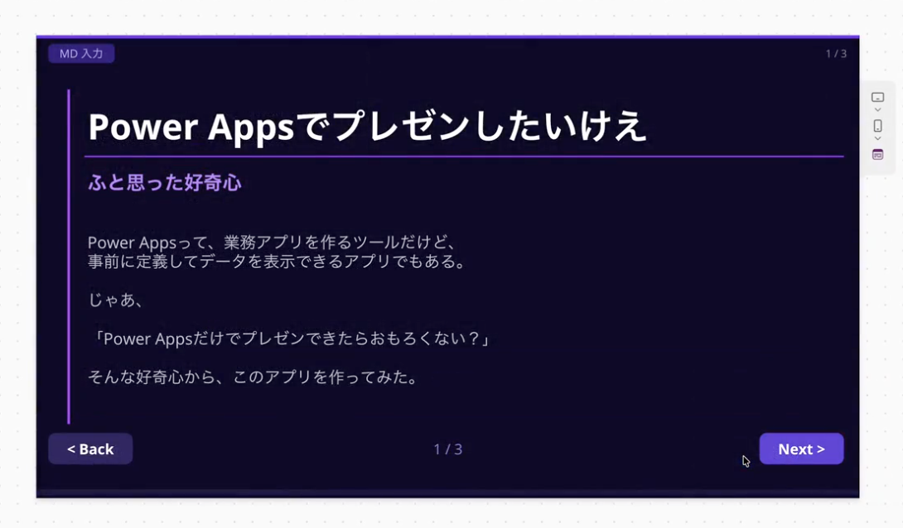

# MarkdownSlides

Markdown テキストを貼り付けるだけで、スライド形式で表示できる Power Apps Canvas アプリです。

## スクリーンショット

## インポート方法

1. [Power Apps](https://make.powerapps.com/) にサインインする
2. 左メニューの「アプリ」を開く
3. 上部の「インポート」→「キャンバスアプリのインポート」をクリック
4. `MarkdownSlides.msapp` を選択してアップロード
5. 画面の指示に従ってインポートを完了する

## 必要な接続・権限

特になし（外部コネクタ不使用）

## 使い方

1. アプリを開く
2. テキスト入力欄に Markdown テキストを貼り付ける
3. スライドとして表示される

## 注意事項

- Power Apps の有効なライセンスが必要です
- 動作確認環境: Power Apps (2025年3月時点)

## ライセンス

MIT License
